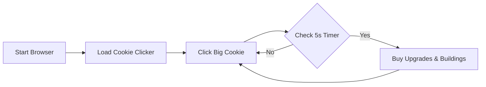

<div align="center">

  <h1>🍪 Cookie Clicker Bot</h1>
  <p><b>Day 48 / 100 Days of Code</b> • <i>Python x Selenium Automation</i></p>

  <p>An intelligent, autonomous bot designed to automate gameplay, purchase upgrades, and maximize cookie production efficiency in real time.</p>

  <p>
    <a href="#-demo"><strong>View Demo</strong></a> •
    <a href="#-installation"><strong>Quick Start</strong></a> •
    <a href="https://github.com/guptaji0358/cookie-clicker-bot/stargazers"><strong>⭐ Star Repo</strong></a>
  </p>

  <br />

  <p>
    
    
    
    
    
  </p>

</div>

---

## ⚡ Highlights

* **🖱️ Non-Stop Auto-Clicking:** Rapidly clicks the big cookie without delay.
* **⚡ Smart Upgrade System:** Constantly monitors and automatically buys unlocked upgrades.
* **🏗️ Building Automation:** Acquires the most effective production items as soon as they become affordable.
* **🔄 Autonomous Feedback Loop:** Scales CPS (Cookies Per Second) exponentially without manual input.

---

## 🎬 Demo

<div align="center">
  <a href="https://www.youtube.com/watch?v=snG523oDSCo" target="_blank">
    
  </a>
  <p><i>▶️ Click the thumbnail above to watch the demo on YouTube</i></p>
</div>

---

## 🛠️ Built With

| Tech | Description |
| :--- | :--- |
| **Python 3** | Core scripting language |
| **Selenium WebDriver** | Browser automation & DOM manipulation |
| **ChromeDriver** | Native browser execution framework |

---

```markdown
## 📂 Project Structure

```bash
cookie-clicker-bot/
│
├── 48_COOKIE_CLICKER_BOT.py   # Main automation script
└── README.md                  # Project documentation

```

---

## 🚀 Quick Start

### 1. Clone the Repository

```bash
git clone [https://github.com/guptaji0358/cookie-clicker-bot.git](https://github.com/guptaji0358/cookie-clicker-bot.git)
cd cookie-clicker-bot

```

### 2. Install Dependencies

```bash
pip install selenium

```

### 3. Run the Bot

```bash
python 48_COOKIE_CLICKER_BOT.py

```

---

## 🤖 How It Works



1. **Initialization:** Launches Google Chrome via Selenium WebDriver and navigates to the Cookie Clicker web app.
2. **Execution Loop:** Rapidly sends click events to the primary cookie element.
3. **Evaluation:** Checks every 5 seconds for available upgrades (`.upgrade.enabled`) and top-tier buildings (`.product.enabled`).
4. **Optimization:** Automatically purchases items to scale cookie generation and reports final Cookies Per Second (CPS) upon completion.

---

## 📸 Terminal Output

```text
Game Loaded!

Upgrade Bought!
Bought: Cursor

Upgrade Bought!
Bought: Grandma

Final CPS: per second: 12,421

```

---

## 🧠 Core Concepts Practiced

* **Browser Automation:** Locating dynamic DOM elements using CSS Selectors and IDs.
* **Timed Execution Loops:** Managing interval checks alongside high-frequency click loops.
* **Autonomous Decision Logic:** Programmatically prioritizing purchases based on state changes.

---

## ⚠️ Disclaimer

This project was built strictly for educational purposes as part of a 100 Days of Code challenge.

---

Designed & Built with ❤️ by **Robin Gupta**
